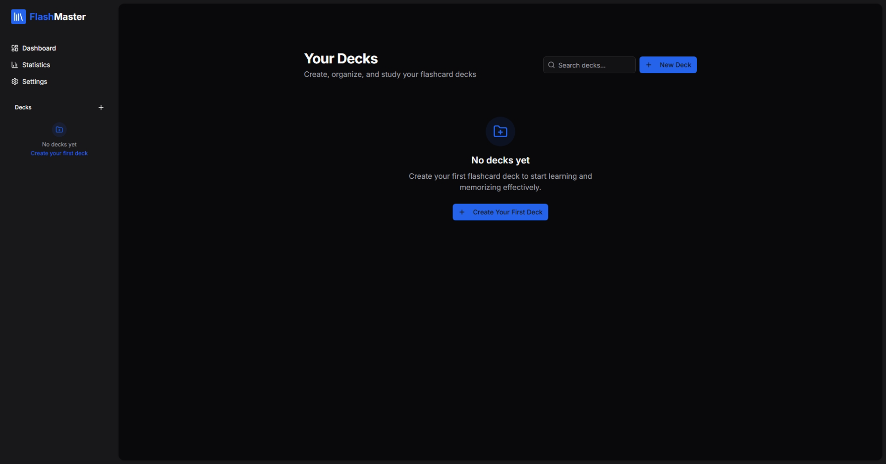
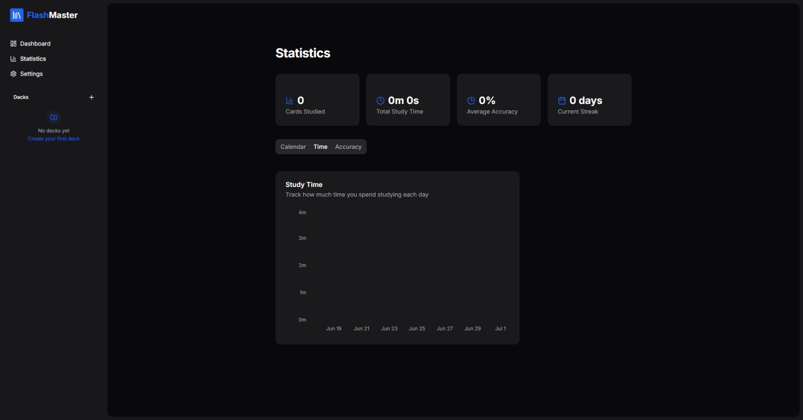
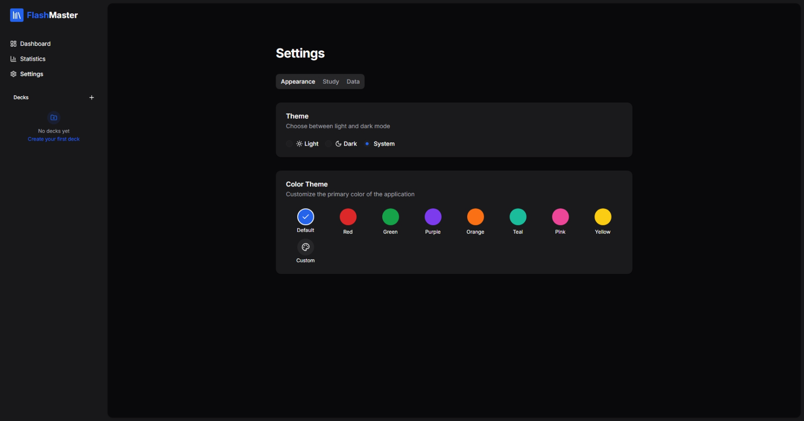

# FlashMaster

**FlashMaster** é uma aplicação de estudo com flashcards baseada em repetição espaçada, que ajuda você a memorizar conteúdos de forma eficiente e duradoura.

## 📌 Principais Funcionalidades

- **Repetição Espaçada**  
  Algoritmo inteligente que ajusta o intervalo de revisão de cada card para maximizar a retenção de memória.

- **Criação e Edição de Flashcards**  
  Adicione, remova e edite cards com perguntas e respostas customizadas.

- **Organização por Categorias**  
  Separe seus flashcards por assuntos, facilitando a navegação e o foco nos temas desejados.

- **Estatísticas de Progresso**  
  Acompanhe seu desempenho com gráficos de acertos, revisões pendentes e tempo de estudo.

- **Modo Noturno**  
  Tema escuro para uma experiência de estudo confortável em ambientes com pouca luminosidade.

## 🛠️ Tecnologias Utilizadas

- **TypeScript**
- **Next.js**
- **Vercel** (deploy e hospedagem)
- **shadcn/ui** (componentes de interface)
- **lucide-react** (ícones)

## 🖼️ Capturas de Tela

  
   
  
   
  

## 📚 Como Usar

1. **Crie um Deck:** Agrupe todos os flashcards com o mesmo tema através de um "Deck"

2. **Adicionar Flashcards:** Clique em “add Card”, preencha pergunta e resposta.

3. **Iniciar Sessão de Estudo:** Clique “Study” e comece a revisar os cards.

4. **Acompanhar Estatísticas:** Na aba “Statistics”, visualize gráficos de desempenho de estudo.

#### Se este projeto te ajudou, deixe uma ⭐
